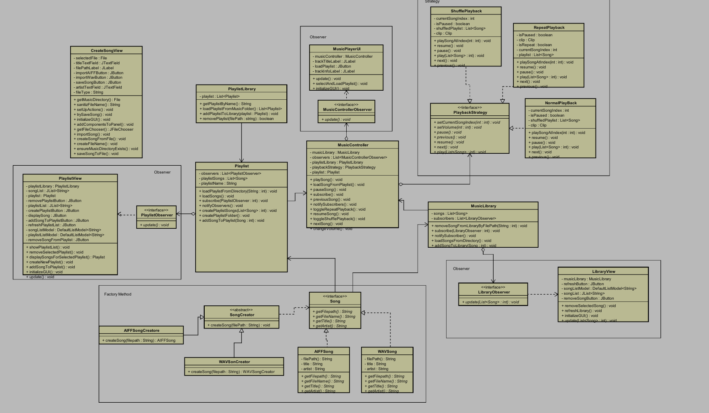

## Name: 
-  _Husarescu Rares Matei_
-  _Costache Alin Florian_
## Student Number: 
- _4868730_
- 00000000
## Course: 
- Design patterns

## Problem Description
Imagine you are a software developer tasked with creating a simple music player application. This application will be used by people who want to listen to their favorite songs on their computer. 

The application should have the following features: 

*Song Selection*: Users should be able to browse their music library and select a song to play. They might have a large collection, so think about how to make this process user-friendly. 

*Playing Music*: Once a playlist is selected, users should be able to play the Playlist. They should also have the option to pause the song if needed. 

*Volume Control*: Users should be able to adjust the volume of the music to their liking. They might want to listen to music softly in the background or blast their favorite song, so make sure the volume control is easy to use. 

*Creating Playlists*: Users should be able to create their own playlists. They might want to make a playlist for a party, a workout, or just their favorite songs. They should be able to add songs to the playlist and remove songs from the playlist. 

*Shuffling Songs*: Sometimes, users might want to mix things up. The application should have a feature that shuffles the songs in the playlist, playing them in a random order. 

*Repeat Song*: Sometimes, users might want to listen the same song over and over again.. The application should have a feature that let the user play a selected song again and again. 

*User Interface*: All of these features should be easy to use. The application should have a simple, intuitive user interface. Users should be able to easily find and use all of the features. 

## MosCoW Analysis 

| Mo (Must have) |                                                                                                 |
|----------------|-------------------------------------------------------------------------------------------------|
|                | Music Library Management: Ability to add, remove, and manage songs in the library.              |
|                | Basic Playback Controls: Play, pause, and resume functionalities for songs.                     |
|                | Playlist Creation: Ability to create and manage playlists.                                      |
|                | Creating a song(Factory Method) : Ability to create a song by using a WAV or AIFF file                               
|                | Observer Pattern Implementation: To ensure the UI automatically updates in response to changes in the music library or playlists.                                                                                                      |
|                | Basic UI: A minimal user interface (MusicPlayerUI) that allows users to interact with the music player, including selecting songs, playing music, and viewing playlists.                                                             |
| S (Should have)|                                                                                                 |
|                | Volume Control: Ability to adjust the volume (VolumeCommand).                                   |
|                | Shuffle and Repeat: Playback strategy for playing songs in a random order and an option to repeat songs or playlists. |
| Co (Could have)|                                                                                                 |
|                | Video Playback: Support for music videos or visualizers.                                        |
| W (Won’t have) |                                                                                                 |
|                | Music Purchase Integration: Buying songs or playlists directly from the app.                    |
|                | Live Streaming Services: Integrating live music or radio streaming ser

# Design Patterns Overview

Design patterns are standard solutions to common problems in software design. Each pattern is like a blueprint that you can customize to solve a particular design problem in your code. Here's an overview of some fundamental design patterns:

## Factory Pattern (specifically Song Creation)

- **What it does:** Imagine you're at a restaurant where you can customize your meal. You choose what you want (like pasta, pizza, or a salad), but you don't need to know how the kitchen makes it. The Factory pattern works similarly for creating a song. You decide the type of song you want (like "AIFF" or "WAV"), and the Factory handles the creation details.
- **Problem it solves:** This pattern keeps you from needing to know all the technical details of how a song is made. It makes the app easier to change and grow because you can add new song types(MP3, AAC, FLAC etc.) without messing with the rest of the code.

## Strategy Pattern (specifically Playback)

- **What it does:** Think of this like having different travel routes for getting to a destination depending on the time of day or traffic. The Strategy pattern allows you to choose different ways (or strategies) for doing something, like selecting the next song to play. You can switch strategies easily, like choosing between playing songs in order, randomly, or to play the same song, only on a button press.
- **Problem it solves:** It gives  flexibility in how you do things, like playing songs, without having to change the player's core. You can easily add new ways to play the songs from a playlist as you think of them.

## Observer Pattern

- **What it does:** It's like subscribing to a newsletter. Once you sign up, you automatically get updates whenever there's news. In the Observer pattern, parts of your app "subscribe" to changes in other parts. For example, if you add a new song to a playlist, the playlist view automatically updates to show this without you having to do anything extra / or sometimes you need to press a refresh a button.
- **Problem it solves:** Keeps different parts of the app in sync without them needing to constantly check in with each other. This way, when something changes (like adding a new song, creating a new playlist etc), all subscribed parts get updated automatically, making sure the app always shows the latest info.

## MVC Architecture Section:
- **`Model`**: 
    - Represents the application's data and business logic.
    - In this application, this includes classes like Song, Playlist, PlaylistLibrary and MusicLibrary.
    - `Also, all the classes from Factory Method folder (AIFFSong, AIFFSongCreator, SongCreator, WAVSong, WAVSongCreator). For a better view/ understading we decided to keep the Factory Method folder out from the Model.`
    - The Model is responsible for managing the data, logic, and rules of the application.
- **`View`**: 
    - Represents the UI components of the application.
    - Includes classes like MusicPlayerUI, PlaylistView, and LibraryView, CreateSongView.
    - The View is responsible for displaying the data provided by the Model in a specific format.
- **`Controller`**: 
    - Acts as an interface between Model and View components.
    - Contains classes like MusicController that handle user input and convert it to commands for the Model or View.
    - The Controller interprets the input from the user, making calls to model objects to retrieve data or to view objects to display changes.

# Classes
The following document outlines the structure and responsibilities of each class within the music player application as defined by the provided class diagram.

## User Interface Classes

### `CreateSongView`
- **Description**: Manages the interface for song creation.
- **Responsibilities**: Handles file selection, metadata input, and saving new song entries.

### `PlaylistView`
- **Description**: Manages the display and interactions within a playlist.
- **Responsibilities**: Updates playlist display.

### `MusicPlayerUI`
- **Description**: Provides the user interface controls for music playback.
- **Responsibilities**: Interacts with the music controller for play, stop, and other playback actions.

### `LibraryView`
- **Description**: Presents the music library interface.
- **Responsibilities**: Refreshes the view, selects songs, and initializes UI components.

## Model Classes

### `PlaylistLibrary`
- **Description**: Represents a collection of playlists.
- **Responsibilities**: Loads and saves playlists, notifies observers of changes.

### `Playlist`
- **Description**: Stores details of a specific playlist.
- **Responsibilities**: Manages playlist content, including adding and removing songs.

### `MusicLibrary`
- **Description**: Manages the collection of all songs.
- **Responsibilities**: Adds and removes songs, notifies observers of library updates.

### `AIFFSong`, `WAVSong`
- **Description**: Represents song entities for AIFF and WAV formats.
- **Responsibilities**: Stores and retrieves song information and format-specific details.

## Controller Classes

### `MusicController`
- **Description**: Serves as the controller for music flow.
- **Responsibilities**: Maintains libraries, controls current playlists, and manages playback strategies.

## Playback Strategy Classes

### `ShufflePlayback`, `RepeatPlayback`, `NormalPlayback`
- **Description**: Defines different playback strategies.
- **Responsibilities**: Manages order and mode of song playback according to the strategy (shuffle, repeat, normal).

## Factory Classes

### `AIFFSongCreator`, `WAVSongCreator`
- **Description**: Handles the creation of song objects in specific formats.
- **Responsibilities**: Creates `AIFFSong` or `WAVSong` instances with appropriate metadata.

## Observer Interfaces

### `PlaylistObserver`, `MusicControllerObserver`, `LibraryObserver`
- **Description**: Defines methods for observer notifications.
- **Responsibilities**: Receives updates on changes in the subject being observed (playlist, music controller, library).
  
## Class Diagram

### Input & Output

In this section the input and output of the application will be described
#### Input

### `CreateSongView`
| Case                    | Type          | Conditions                                               |
|-------------------------|---------------|----------------------------------------------------------|
| Select audio file       | File path     | File must be in a supported audio format.                |
| Input song metadata     | Text/String   | Fields for artist, title, album, etc., must be filled.   |
| Save song information   | Command/Event | All required fields must be valid before saving.         |

### `PlaylistView`
| Case                     | Type          | Conditions                                               |
|--------------------------|---------------|----------------------------------------------------------|
| Select song to play      | Song /Ref   | Song must be available in the playlist.                  |
| Select song to remove    | Song /Ref   | Song must be available in the playlist for removal.      |

### `PlaylistLibrary`
| Case                    | Type          | Conditions                                               |
|-------------------------|---------------|----------------------------------------------------------|
| Load playlist           | Playlist    | Playlist must exist within the user's library.           |
| Create new playlist     | Text/String   | Requires a name for the new playlist.                    |
| Delete playlist         | Playlist    | Playlist must exist and be selected for deletion.        |

### `MusicLibrary`
| Case                     | Type          | Conditions                                               |
|--------------------------|---------------|----------------------------------------------------------|
| Add new song             | Song Object   | Song must not already be present in the library.         |
| Remove existing song     | Song /Ref   | Song must exist in the library for removal.              |

### `MusicController`
| Case                       | Type          | Conditions                                               |
|----------------------------|---------------|----------------------------------------------------------|
| Select song to control     | Song /Ref   | Song must be loaded for playback control actions.        |
| Choose playback strategy   | Playback | A valid playback strategy must be selected.               |

#### Output

### `CreateSongView`
| Case                          | Type          | Conditions                                               |
|-------------------------------|---------------|----------------------------------------------------------|
| Song file selection confirmed | File path     | Path to the selected audio file is output for processing.|
| Metadata entered              | Text/String   | Entered metadata is output for song creation.            |
| Song saved successfully       | Confirmation  | Confirmation of song save operation is output.           |

### `PlaylistView`
| Case                      | Type          | Conditions                                               |
|---------------------------|---------------|----------------------------------------------------------|
| Song playback initiated   | Signal        | Signals the song has begun playing.                      |
| Song removed from playlist | Confirmation  | Confirmation of song removal is output.                  |
| Playlist displayed        | Playlist State | The current state of the playlist is output to the user. |

### `PlaylistLibrary`
| Case                    | Type          | Conditions                                               |
|-------------------------|---------------|----------------------------------------------------------|
| Playlist loaded         | Playlist Data | Loaded playlist details are output to the display.       |
| New playlist created    | Confirmation  | Confirmation of new playlist creation is output.         |
| Playlist deleted        | Confirmation  | Confirmation of playlist deletion is output.             |

### `MusicLibrary`
| Case                        | Type          | Conditions                                               |
|-----------------------------|---------------|----------------------------------------------------------|
| New song added to library   | Confirmation  | Confirmation of new song addition is output.             |
| Song removed from library   | Confirmation  | Confirmation of song removal is output.                  |
| Music library updated       | Library State | Updated library content is output for user display.      |

### `MusicController`
| Case                         | Type          | Conditions                                               |
|------------------------------|---------------|----------------------------------------------------------|
| Playback control signal sent | Signal        | Outputs signal indicating playback action (play, pause, etc.) |
| Playback strategy changed    | Confirmation  | Confirmation of change in playback strategy is output.   |
